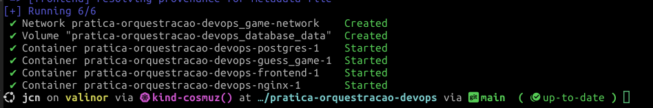
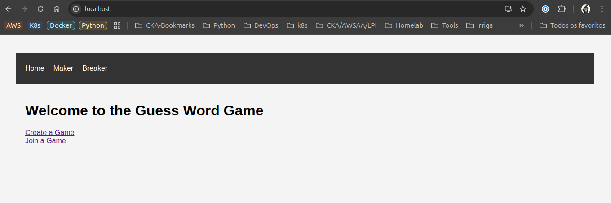

# Instrução para execução do projeto

---

## Para execução do projeto, devemos atender os requisitos:

- **GIT** - [Instalando o GIT](https://git-scm.com/book/pt-br/v2/Come%C3%A7ando-Instalando-o-Git)
- **Docker** - [Instalando o Docker](https://docs.docker.com/engine/install/)
- **Docker Compose** - [Instalando o docker compose](https://docs.docker.com/compose/install/linux/)

---

## Execução do projeto

Primeiramente, devemos realizar o clone do projeto na máquina, realizando da seguinte forma:

```
git clone https://github.com/akajcn/pratica-orquestracao-devops.git
``` 

Após realizar o clone do projeto, temos que entrar no diretório récem clonado, com o comando a seguir:

```
cd pratica-orquestracao-devops/
```

Após entrar no diretório através do comando acima, vamos iniciar o deploy do projeto. O projeto é iniciado com o comando:

```
docker compose up -d
```

Após a execução com sucesso do comando, teremos esta saída:



Agora, abra o navegador e acesse o endereço http://localhost

Devemos visualizar a seguinte página



### ATENÇÃO!!

Para que a aplicação funcione corretamente, as portas 3000 (frontend), 5000 (backend), 5432 (Postgres) e 80 (nginx) não podem estar em uso. Caso alguma destas portas estejam em uso, ocorrerá um conflito e a aplicação não subirá!

Caso alguma destas portas estejam em uso, pode ser realizado o mapeamento delas através do arquivo docker-compose.yaml, que está na raíz do projeto e no arquivo **nginx.conf** localizado no diretorio **nginx**.

---

## Estrutura dos arquivos

1. **Backend**

    Onde estão os arquivos referentes ao deploy do backend do projeto. Neste diretório estão os arquivos Python referente ao projeto Flask para inicialização do backend, que vai servir ao Frontend. Neste diretório está o arquivo Dockerfile para realizar o build da imagem do backend. (Python)

2. **Frontend**

    Onde estão os arquivos referentes ao deploy do frtontend do projeto. Neste diretório estão os arquivos referente ao projeto do frontend, que vai integrar ao backend para utilização do jogo. Neste diretório está o arquivo Dockerfile para realizar o build da imagem do frontend. (React)

3. **Nginx**
   
   Onde está o arquivo de configuração que será mapeado no container do nginx para ser mapeado no container do nginx. Este arquivo será responsavel pelo proxy reverso e load balancer realizado pelo nginx.

---

## Conteudo do docker-compose.yml

- Criação do container do frontend: 

```
  frontend:
    restart: always
    build:
      context: ./frontend
      dockerfile: Dockerfile
    environment:
      - REACT_APP_BACKEND_URL=http://localhost
    depends_on:
      - guess_game
    networks:
      - game-network
```
1. **restart: always**

    Vai reiniciar o container sempre que houver uma falha (presente em **todos** os containers)

Vai utilizar o arquivo Dockerfile dentro do contexto **frontend** para buildar a imagem do projeto do Frontend. 
Define que o serviço do frontend depende do serviço do **backend** para inicializar.
Define uma variavel de ambiente com o endereço da URL do backend.

---

- Criação do container do backend

```
guess_game:
    restart: always
    build: 
      context: ./backend
      dockerfile: Dockerfile
    environment:
      - FLASK_APP=run.py
      - FLASK_DB_TYPE=postgres
      - FLASK_DB_USER=prjuser
      - FLASK_DB_PASSWORD=prjpass
      - FLASK_DB_NAME=prjdb
      - FLASK_DB_HOST=postgres
      - FLASK_DB_PORT=5432
    scale: 2
    depends_on:
      - postgres
    healthcheck:
      test: ["CMD", "curl", "-f", "http://localhost:5000/health"]
      interval: 10s
      timeout: 5s
      retries: 3
      start_period: 20s
    networks:
      - game-network
``` 
É realizado o build da imagem através do Dockerfile contido no diretório **backend** 
Informações referentes à conexão ao banco de dados no container do PostgreSQL em variáveis de ambiente.
É realizado um *healtcheck* para garantir que o serviço do backend esteja **up** antes de iniciar o container do nginx

---
- Criação do container do banco de dados (PostgreSQL)
  
```
  postgres:
    restart: always
    image: postgres:latest
    environment:
      POSTGRES_PASSWORD: prjpass
      POSTGRES_USER: prjuser
      POSTGRES_DB: prjdb
    volumes:
      - pg_data:/var/lib/postgresql/data
    networks:
      - game-network
```

Credenciais de acesso ao banco criadas através de variaveis de ambiente, que serão utilizadas pelo serviço do backend para conexão a este banco.
Criação de volume persistente para armazenamento do banco de dados. Com isso mesmo que reinicie o container do banco de dados, os dados não serão perdidos.

    volumes:
      - pg_data:/var/lib/postgresql/data

---
- Criação do container do nginx (proxy pass e load balancer)
  
```
  nginx:
    restart: always
    image: nginx:latest
    volumes:
      - ./nginx/nginx.conf:/etc/nginx/nginx.conf
    depends_on:
      - frontend
      - guess_game
    ports:
      - 80:80
    networks:
      - game-network
```

Criação do arquivo **nginx.conf** com o conteúdo abaixo. Este arquivo é mapeado dentro do container no lugar do arquivo original, e serve para realizar o proxy pass e balanceamento de carga do backend.

```
events { }

http {
    server {
        listen 80;

        location / {
            proxy_pass http://frontend:3000;
            proxy_set_header Host $host;
            proxy_set_header X-Real-IP $remote_addr;
            proxy_set_header X-Forwarded-For $proxy_add_x_forwarded_for;
            proxy_set_header X-Forwarded-Proto $scheme;
        }

        location ~ ^/(create|breaker|guess) {
            proxy_pass http://guess_game:5000;
            proxy_set_header Host $host;
            proxy_set_header X-Real-IP $remote_addr;
            proxy_set_header X-Forwarded-For $proxy_add_x_forwarded_for;
            proxy_set_header X-Forwarded-Proto $scheme;
        }
    }
}
```

---

## Atualização dos containers

Para realizar alterações no versão base das imagens do backend, frontend ou nginx, altere os arquivos correspondentes em cada um dos arquivos **Dockerfile** de cada diretorio (**backend e frontend**) ou no **docker-compose.yml**, conforme necessário. Para realizar alterações nas variáveis de ambiente, devemos alterar no arquivo **docker-compose.yml**. Após realizar estas alterações, execute o comando abaixo (dentro do diretorio do projeto) para aplicar estas alterações.

```
docker compose down
docker compose up -d
```